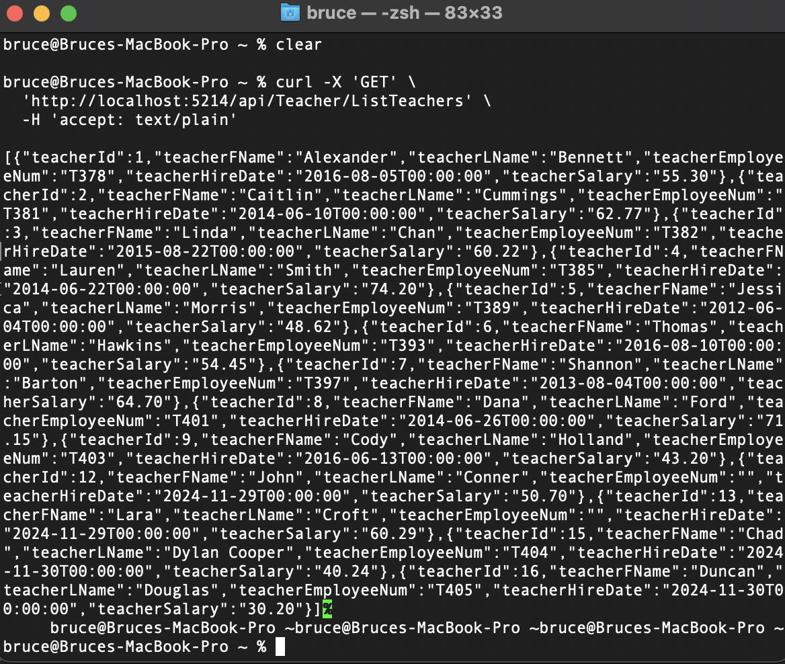
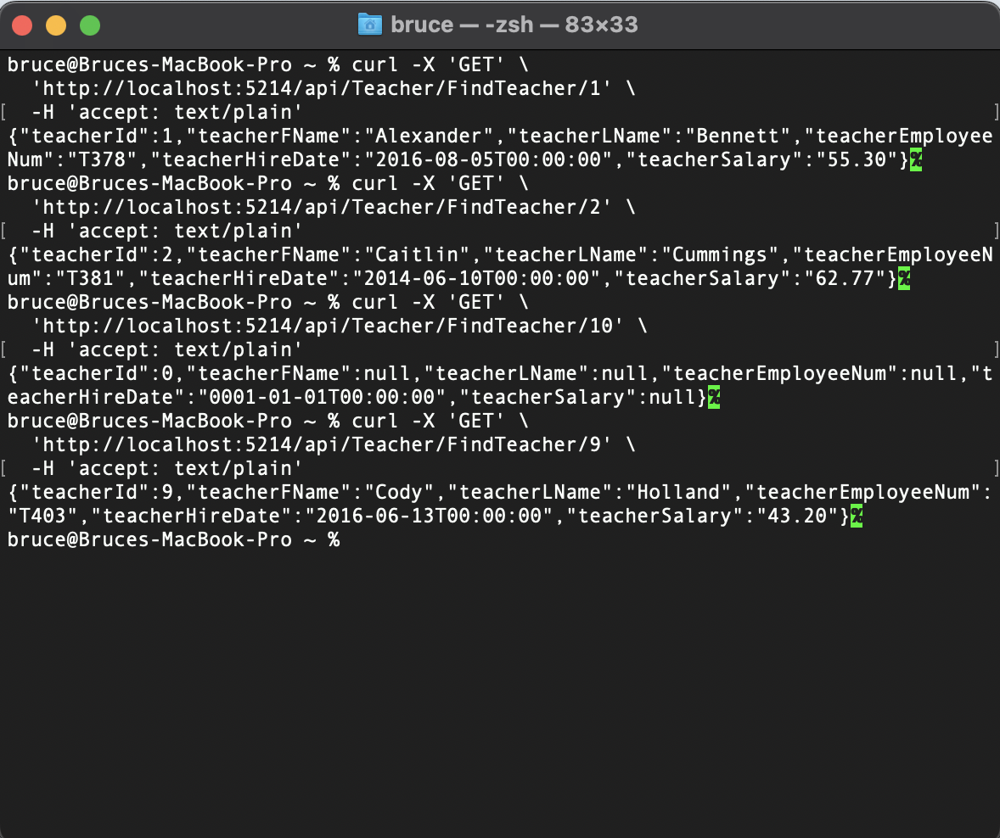
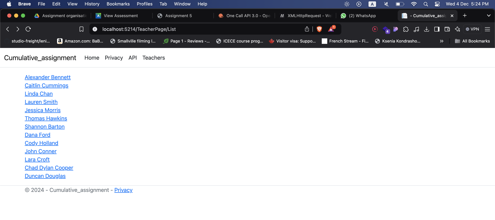
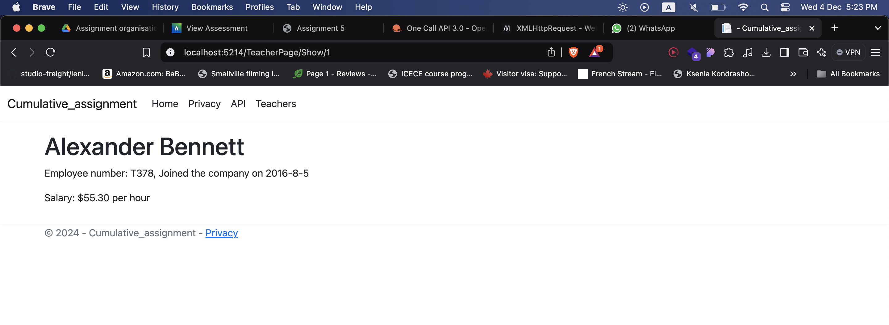

# Cummulative Assignment: Part 1

In this assignment I will be building a (minimum viable product) MVP for the management system of a School connected to their database. The following technology will be used C#, the .NET framework and mySQL.

This branch ```cumulative-Part1``` only has the read functionality implement. Please check ```cumulative-part2``` branch for write and delete functionality.

## How does this project works

MySql.Data.MySqlClient was used to connect this project to a MySQL databbase allowing CRUD operations.

- Models/SchoolDbContext.cs
    - A class which represents the connection to the database. 

- Controllers/AuthorAPIController.cs
    - Information about Teachers can be accessed through the API above

- Program.cs
     - Configuration of the application


## Testing

### These is the Curl test for the GET api/Teacher/ListTeachers:



These is the Curl test for the GET api/Teacher/FindTeacher/{id}:



### These are the screenshot to display a teacher using ```view()```:

Screenshot-1



screenshot-2




