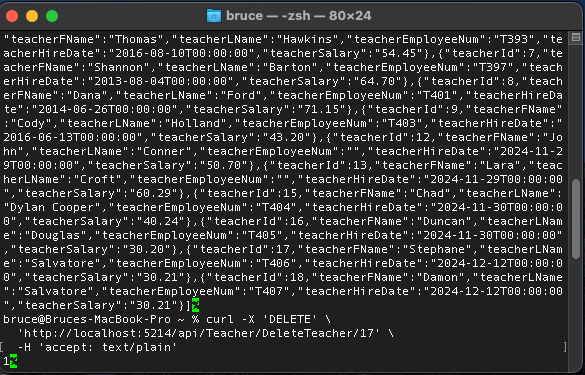

# Cumulative Assignment: part 2

This branch is part 2 of my cumulative assignment where I added the create and delete functionality of the MVP. 

## How does this project work

MySql.Data.MySqlClient was used to connect this project to a MySQL databbase allowing CRUD operations.

- Models/SchoolDbContext.cs
  - A class which represents the connection to the database.

- Controllers/TeacherAPIController.cs
  - Information about Teachers can be accessed through the API above
  
- Controllers/TeacherPageController.cs
  - 

- View for showing the data on the web browser
  - Views/Teacher/New.cshtml
  - Views/Teacher/List.cshtml
  - Views/Teacher/Show.cshtml
  - Views/Teacher/Delete.cshtml

- Program.cs
  - Configuration of the application

  ## Testing

  ### This is the curl test for the POST api/Teacher/AddTeacher

  

  ### This is the curl test for the POST api/Teacher/DeleteTeacher/{TeacherId}

This is the POST request in the terminal deleting teacher with id=17.
  

When calling all the teacher again, you can see that teacher with id=17 is gone.
  

  ### This is the web page that allows a user to enter new Teacher information

    

  ### This is the web page that confirms the action to delete a Teacher

  